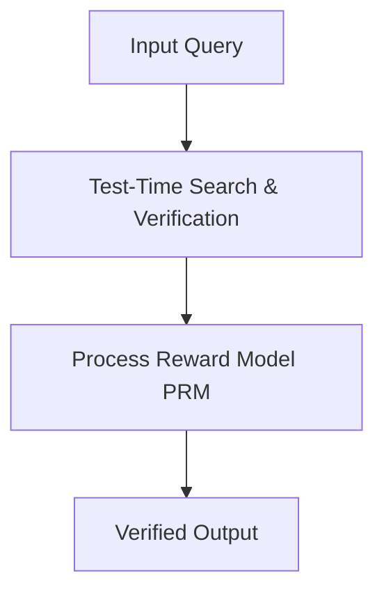

# AI Research Writer Skill (Team Taniv Editorial Methodology)

This skill provides an end-to-end framework for authoring high-performing, technical, and thoughtful AI research dispatches that respect copyright laws, avoid duplicate-content penalties, and provide genuine engineering value.

---

## 1. Core Principles: How to Avoid Copyright Issues

To prevent copyright issues, search engine de-indexing, and legal risks:

1. **NO News Scraping / Article Spinning**:
   - Never take a third-party tech blog post (from TechCrunch, Wired, The Verge, Medium) and ask an AI to "rewrite" or "summarize" it. Paraphrasing third-party text creates derivative works and risks DMCA claims.
   - Always synthesize directly from **primary sources**: open-access ArXiv whitepapers, official open-source GitHub release notes, benchmark logs, and official model cards.
2. **The "Engineering Breakdown" Angle**:
   - Focus on how the mathematics, architecture, or memory subsystem actually works.
   - Explain the concept in clear, original language with original explanations and analogies.
3. **Mandatory Technical Value-Adds**:
   Every post must include:
   - **Original Architecture Diagram** (Mermaid or ASCII) illustrating the underlying dataflow, memory pipeline, or model topology.
   - **Practical Code Example** (Python, TypeScript, or CUDA) written from scratch demonstrating the mechanism.
   - **Empirical Trade-off Table** (Latency, VRAM, Cost per 1M tokens, Failure modes).
4. **Primary Source Attribution**:
   - Every post ends with an explicit "References & Primary Sources" block with clickable links. This establishes legitimate academic fair-use journalism.

---

## 2. Article Structure (The Clean Editorial Blueprint)

Follow this structure for every generated piece:

```markdown
# [Title: Clear, thoughtful technical hook]
*Subtitle: Explanatory value proposition*

### ⚡ Executive Takeaway (The 30-Second Brief)
- Key discovery or architectural shift in 3 crisp bullet points.
- Why this matters to system design and infrastructure bills.

### 1. The Core Bottleneck
- What problem existed in previous models or architectures?
- The mathematical or physical constraint (e.g., KV cache growth, attention complexity, test-time compute scaling).

### 2. Deep Dive: Architectural Breakdown
- Precise technical breakdown in original language.
- System diagram in Mermaid:


### 3. Engineering Blueprint & Code Example
- Clean, syntactically valid code demonstrating the concept from scratch.

### 4. Production Benchmarks & Real-World Economics
- VRAM footprint, tokens per second, or financial comparison table.
- When NOT to use this technique (edge cases and limitations).

### 5. Future Outlook
- What this means for engineers and AI architectures over the next 12 months.

### 📚 References & Primary Sources
- [1] Author et al. (Year). *Paper Title*. ArXiv: [Link]
- [2] Official Repository: [GitHub Link]
```

---

## 3. Post Metadata Schema (JSON)

```json
{
  "id": "slug-id",
  "title": "Clear, Thoughtful Title",
  "subtitle": "Explanatory secondary hook",
  "slug": "slug-id",
  "category": "Reasoning & Scaling | Systems & Optimization | Architecture & Agents | Hardware & Edge AI",
  "readTime": "7 min read",
  "date": "2026-09-05",
  "author": {
    "name": "Team Taniv Research",
    "role": "Systems & AI Research",
    "avatar": "https://images.unsplash.com/photo-1534528741775-53994a69daeb?w=150&auto=format&fit=crop&q=80"
  },
  "tags": ["Reasoning", "Inference", "Architecture"],
  "summary": "2-sentence punchy summary for social cards and search index.",
  "sources": [
    { "title": "Official Paper Title", "url": "https://arxiv.org/abs/..." }
  ],
  "content": "# Full Markdown Body..."
}
```
